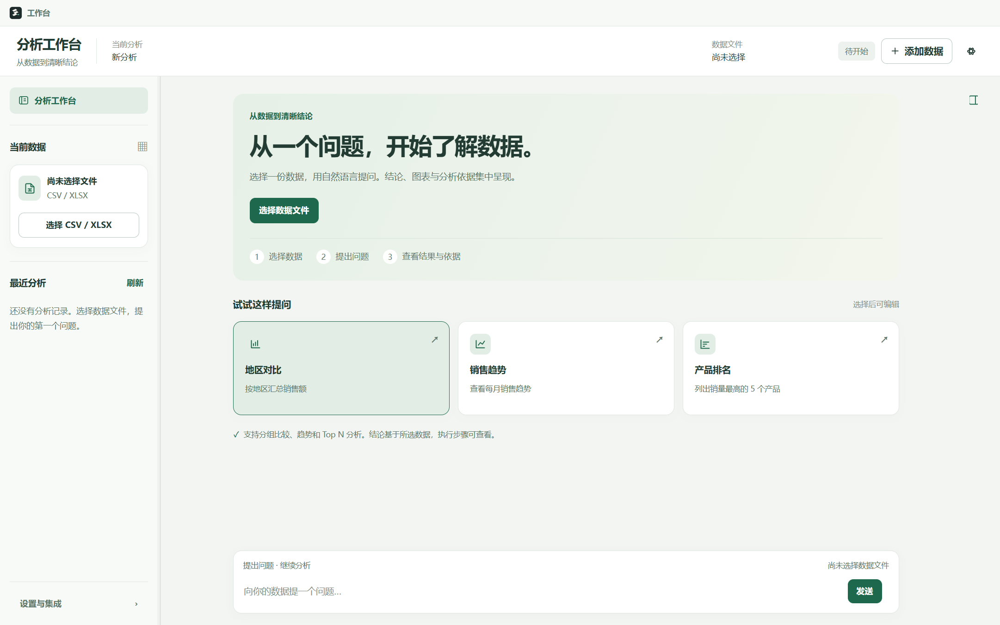
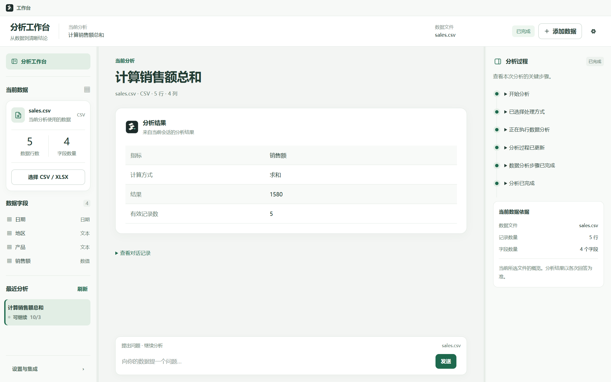
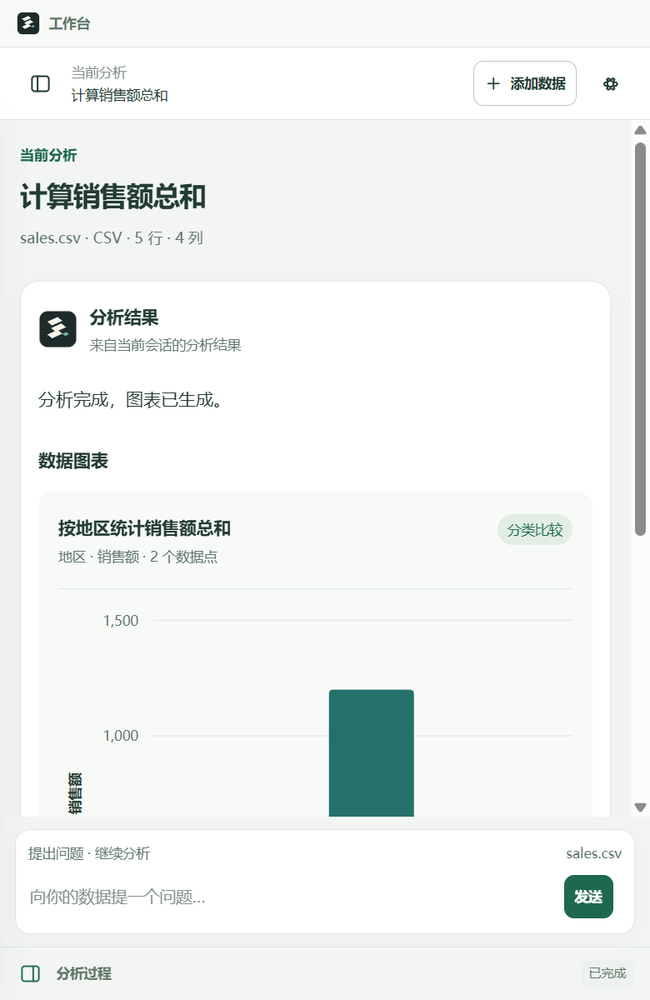

# 证据工作台 UI

用户在 2026-10-02 明确授权“我要证据工作台，现在做”。本次只调整真实 Electron
Renderer 的布局、样式与状态投影，不引入新的分析能力或推进业务 Phase。

## 实现范围

- 左侧：当前文件卡、Runtime 返回的行数/字段数、字段名称与类型、原有 Session 列表。
- 中央：文件入口、三张示例问题卡、实际回答/表格/ChartSpec、对话记录与持续提问输入框。
- 右侧：原有真实事件时间线与当前所选文件的公开概览。开始分析或恢复有事件的会话时，
  宽屏自动展开；跨入 900px 以下时折叠，仍可手动展开。
- 使用浅绿背景、白色内容卡、统一边框和较克制的标题。保留原有分隔条调整宽度、键盘
  焦点、错误重试、停止、审批、会话恢复及 Settings 控件。
- 当前文件概览与会话回答分别标明，选择新文件不会把旧回答宣称为新文件的结果。

## 事实与边界

DatasetSummary 只有公开文件概览，没有原始行。界面不复制设计稿中的示例原始数据，
不读取 CSV/XLSX，不计算占比、汇总或排名。字段与计数来自 Runtime；表格和图表来自
原有答案呈现与 ChartSpec。恢复 Session 时未返回的文件概览保持空，不从旧文本猜测。

生产修改仅限 `desktop/src/renderer/index.html`、`index.ts`、`styles.css`。
新增验收 runner/probe：`desktop/scripts/verify-evidence-workbench.cjs`、
`desktop/tests/evidence-workbench-probe.cjs`。没有新依赖，也没有改原测试或评测预期。
Main/BrowserWindow、Preload、IPC、Python Runtime、Provider/MCP contract、AgentLoop、
Workflow、Session、Memory、HITL 与工具计算保持原实现。

## 专项验证方式

在 `desktop` 目录运行：

```powershell
node scripts/verify-evidence-workbench.cjs --mode dev
node scripts/verify-evidence-workbench.cjs --mode packaged --executable "release/evidence-workbench-final-20261002/win-unpacked/Data Analysis Agent.exe"
node scripts/verify-evidence-workbench.cjs --mode installed --executable "release/evidence-workbench-installed-final-20261002/Data Analysis Agent.exe"
```

三种形态均启动真实生产 Main/Preload/Renderer 与 Python。测试只提供 chooser 回答，
CSV 注册、工具计算和 Runtime 事件真实。独立 userData，不继承开发 PATH/Provider Key；
打包/安装检查 app.isPackaged、实际 exe 路径和 app.asar URL。通过 DOM MutationObserver
等待真实状态，以动画完成事件和绘制帧核对布局，没有固定 sleep 或恢复窗口补丁。

七项检查涵盖空态无虚构数据、dialog parent、sales.csv 的 5 行/4 字段、真实结果 1580、
不重叠的三栏与唯一事件、地区图表数据华南 1,200/华东 380、Settings 控件/遮挡、
1000/700/520px 页面边界与输入框、原 Session IPC。每种形态保存空态、结果、图表、
Settings、窄屏截图与 result.json。

另运行原 Desktop 测试/Electron E2E、实际 exe 双启动 smoke、窗口生命周期专项、
资源审计、私有 Provider/MCP 集成与根目录回归。原生 chooser 人工复验与自动回答
明确区分：本次 UI 专项不宣称新增人工原生选择验收。

## 交付验收

2026-10-04 完成交付记录核对；构建和真实安装/运行验收在 2026-10-02～03 完成。
完整结果见 [机器可读验收记录](../tests/results/evidence-workbench-ui-regression.json)。

- dev / packaged / installed 各 7 项界面专项，21/21 PASS；窗口/IPC 自动专项各 8 项，
  24/24 PASS。CSV 成功、取消、注册失败/重试和 Renderer reload 后均能继续分析。
- 打包/安装 exe 各实际启动两次，Settings、MCP、HITL 拒绝、CSV 1580、配置/Session/
  Trace 恢复均 PASS；恢复不发起新运行。两套资源审计与私有 Provider/MCP 集成 PASS。
- TypeScript、Desktop 38/38、Electron smoke、dev E2E 10 步、Node 13/13、Python 400/400、
  P0 15/15、P1 20/20、Robustness 25/25、Day19 60/60、Regression Gate 11/11 均 PASS；
  security violations=0、contract failures=0。原有评测目标和断言未修改。
- 275 个受保护源码/测试文件 SHA256 全部不变；打包与安装的 HTML、styles.css、bundle.js
  与当前 dist 构建逐字节一致。历史 Phase 2.9 安装包 SHA256 不变。
- 最终 NSIS：`desktop/release/evidence-workbench-final-20261002/Data Analysis Agent Setup 0.1.0.exe`，
  147328858 bytes，SHA256 `69803815A3B5037058AFFF3AE17B95D981C0D844B24FB3AE6B5C16A96C47200C`。
- `/S /CURRENTUSER /D=...` 真实安装 exit 0，安装目录
  `desktop/release/evidence-workbench-installed-final-20261002`，含实际 exe 与 uninstaller。
  仍为本地未签名 0.1.0 构建，未发布 GitHub Release。

安装版真实截图：







历史 Phase 2.9.1 首次窗口消失的根因仍未确认，本次没有窗口修复；Phase 2.9 不据此
标记为最终完全通过。Phase 2.3 的历史真实 OpenAI HTTP 429 缺口继续保留。
