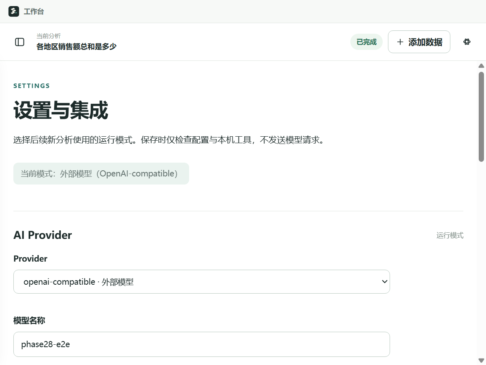

# Phase 2.8：Desktop Provider / MCP 配置

## 页面与默认行为

Settings 提供两个可用模式：`deterministic`（本地 / 测试）与
`openai-compatible`（外部模型）。外部模式只填写 `model_name`、`endpoint`、
`api_key_env`；没有 API Key 输入框、环境变量值查询接口或模型连接测试按钮。
页面分别显示已应用模式、凭据可用性和配置错误，未保存的选择不代表运行模式已切换。

首次 Desktop 启动默认 deterministic、Filesystem MCP 停用。外部配置仅在显式保存并通过
校验后应用；缺字段、缺凭据、不支持的配置或 MCP 不可用均明确失败，不 fallback。
凭据“可用”只表示 Runtime 能从指定环境变量读取有效值，不证明远端服务可用。

配置用于后续新分析；当前分析未结束时不能应用配置。Settings 不把 endpoint、模型名或
环境变量名添加到主分析区。其他 Providers、数据源与报告服务仍保留“规划中”入口。



## 配置链路

```text
Renderer Settings 表单（仅非敏感字段）
  → sandboxed Preload 的 window.desktopSettings（仅 getSettings / applySettings）
  → Main settings:get / settings:apply
  → SettingsController / SettingsStore（userData/runtime-settings.json）
  → RuntimeClient 独立 settings.get / settings.apply response
  → Python Supervisor 的 Runtime 配置层
  → 原 Provider Factory / 原 MCPHost 预检
  → 私有 worker 环境传递非敏感配置快照
  → worker 原模型/Registry 组装位置
  → 原 Provider Factory + 原 MCPHost / Adapter / ToolRegistry
  → 原 Workflow / Skill / AgentLoop
```

已有分析/文件/Session/Approval IPC、`window.agent` 方法与 Runtime Event envelope 保持
不变；只增加独立 Settings API 与 Runtime 配置命令/response。配置 response 不作为
AgentEvent 广播，也不写入 Session 或 Trace。

Runtime Supervisor 保留已应用配置，每次新 worker 获取非敏感快照；不把配置加进
run.start command、问题或 Agent messages。没有修改 Provider/MCP contract、AgentLoop、
Workflow、Skill、Session、Memory、HITL、Registry/Guardrail 的实现。

## 保存、恢复与失败

Main 只保存以下固定字段：

```json
{
  "provider": {
    "provider_id": "deterministic",
    "model_name": null,
    "endpoint": null,
    "api_key_env": null
  },
  "mcp": { "enabled": false }
}
```

外部模式的字段替换为用户显式填写的非敏感名称、服务地址与凭据变量名。本地模式不接受
外部配置字段；未知字段、`api_key` 等密钥字段、凭据格式值、URL 用户名/密码/查询参数
均被拒绝。Main 与 Runtime 各自验证固定 schema。

Runtime 成功应用后，Main 使用临时文件 + rename 保存；保存失败恢复之前的 Runtime
配置并明确报错。损坏的配置文件阻止分析，用户可以显式重新保存有效配置修复。
重新启动应用或 Supervisor 后，Main 恢复非敏感配置；如果外部凭据缺失，仍显示已保存的
外部模式与缺凭据状态，并阻止新分析，不退回 deterministic。

API Key 只由原 Provider 在 Runtime 进程中按 `api_key_env` 引用读取；不加载 `.env`。
如果原 Provider 检测到配置字段含凭据内容，返回固定错误，不把该配置回传 Renderer。
设置错误不回显提交值或底层异常。真实 Key、Authorization 和完整请求/响应不会进入
Settings 文件、Renderer、Session、Trace、Runtime Event 或日志。

## Filesystem MCP 的固定权限

用户只可启停 Phase 2.6 同一个官方 Filesystem Server。配置不接受 root、command、env、
server、allowed_tools、写权限或其他扩展字段。原固定根仍为
`tests/fixtures/mcp-readonly`，已注册工具只有 `mcp_filesystem__get_file_info`。
页面显示相对目录的安全摘要与只读状态，不公开宿主绝对路径。

启用预检通过原 MCPHost/Client/Adapter 实际启动服务并 list_tools，临时 Host 随即关闭。
每次分析 worker 使用原 HITL Registry 组装并显式接入同一只读工具，之后继续走原参数
校验、Guardrail、ToolResult、截断与 Trace；worker 正常退出时关闭 Host。
MCP 停用不启动这个真实服务，也不改变原 HITL/mock 工具行为。

开发环境的 Node 由宿主固定路径或 PATH 查找；Phase 2.9 安装环境只使用私有 Node，
缺失时明确失败。Renderer 无法指定执行命令。MCP 使用原 `env={}`
与 SDK OS 变量白名单，Provider 凭据/配置不传给 Node。协议白名单不是 OS 沙箱。

## 验证与阶段边界

2026-09-28：新增 Desktop 配置专项 8/8、Python 配置专项 14/14；TypeScript、Desktop
38/38、Electron smoke/E2E 10 步、Provider 79/79、MCP 48/48、原 Phase 2.7 联调 18/18、
Node 13/13、Python 全量 396/396、P0 15/15、P1 20/20、Robustness 25/25、Day19 60/60、
Regression Gate 11/11 全 PASS。security violations=0、contract failures=0；79 个核心
Python 文件阶段前后哈希一致，评测标准/baseline 未修改。

[Phase 2.8 验收与全量回归记录](../tests/results/desktop-settings-phase28-regression.json)。

新增 Desktop Settings 专项验证默认/切换、字段与凭据缺失、只读 MCP 开关、非法范围、
存储与重启、错误恢复、真实 worker / 本机可控 HTTP / 真实 MCP 的闭环，以及配置不进入
Session/Trace/日志。Electron E2E 通过实际 UI/Preload/Main 验证保存、拒绝与重启恢复。
所有模型凭据均为独立的合成测试值，没有真实外部模型请求。

**Phase 2.3 仍未完成：此前两次 OpenAI 调用均 HTTP 429。** 本机 HTTP 验证不能替代
真实 OpenAI 服务/模型兼容性验收；本阶段不处理 429、不再次调用 OpenAI。

以下为 Phase 2.8 历史打包状态：当时更新源码与 sidecar staging，不重建 NSIS。
Phase 2.9 已补齐固定依赖、构建新 NSIS 并完成真实安装与自动验收，见
[打包与安装证据及人工复核限制](Desktop-Packaged-Provider-MCP-Acceptance.md)。
现有旧安装不会自动更新。
MCP 启用需要已安装的 Phase 2.6 固定 npm Server 与 MCP Python SDK；当前基础 sidecar
不自动打包这些可选依赖。缺依赖明确不可用。目录仍为公开验收 fixture，没有用户目录
授权，也没有新增 Server、Provider、复杂重试或更宽的 Schema/Resources 权限。
